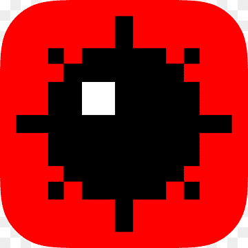
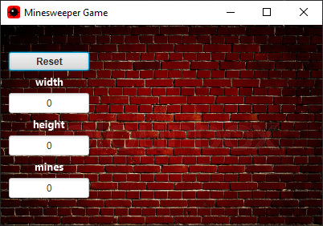
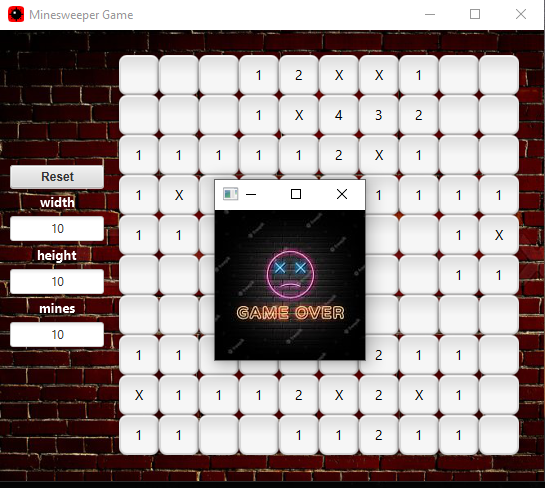

<div id="top"></div>

[![Contributors][contributors-shield]][contributors-url]
[![Forks][forks-shield]][forks-url]
[![Stargazers][stars-shield]][stars-url]
[![Issues][issues-shield]][issues-url]
[![LinkedIn][linkedin-shield]][linkedin-url]


<!-- PROJECT LOGO -->
<br />
<div align="center">
  <a href="https://github.com/OmriGawi/Minesweeper-Game">
    
  </a>

<h3 align="center">Minesweeper Game</h3>

  <p align="center">
    <br />
    <a href="https://github.com/OmriGawi/Minesweeper-Game"><strong>Explore the docs »</strong></a>
    <br />
    <br />
    <a href="https://github.com/OmriGawi/Minesweeper-Game">View Demo</a>
    ·
    <a href="https://github.com/OmriGawi/Minesweeper-Game/issues">Report Bug</a>
    ·
    <a href="https://github.com/OmriGawi/Minesweeper-Game/issues">Request Feature</a>
  </p>
</div>


<!-- TABLE OF CONTENTS -->
<details>
  <summary>Table of Contents</summary>
  <ol>
    <li>
      <a href="#about-the-project">About The Project</a>
      <ul>
        <li><a href="#built-with">Built With</a></li>
      </ul>
    </li>
    <li>
      <a href="#getting-started">Getting Started</a>
      <ul>
        <li><a href="#installation">Installation</a></li>
      </ul>
    </li>
    <li><a href="#usage">Usage</a></li>
    <li><a href="#contributing">Contributing</a></li>
    <li><a href="#Upcomming-features">Upcomming features</a></li>
    <li><a href="#contact">Contact</a></li>
  </ol>
</details>


<!-- ABOUT THE PROJECT -->
## About The Project
Minesweeper is single-player logic-based computer game played on rectangular board whose object is to locate a predetermined number of randomly-placed "mines" in the shortest possible time by clicking on "safe" squares while avoiding the squares with mines.


<p align="right">(<a href="#top">back to top</a>)</p>


### Built With

* [Java](https://www.oracle.com/java/)
* [SceneBuilder](https://gluonhq.com/products/scene-builder/)


<p align="right">(<a href="#top">back to top</a>)</p>


<!-- GETTING STARTED -->
## Getting Started

### Installation

1. Clone the repo
   ```sh
   git clone https://github.com/OmriGawi/Minesweeper-Game.git
   ```
2. Run MinesFX.java

3. Play

<p align="right">(<a href="#top">back to top</a>)</p>


<!-- USAGE EXAMPLES -->
## Usage

* **Left Click** - Remove tile and uncover square to display number of adjacent squares with mines.
* **Right Click** - Add or remove flag.
* Click **Reset** to start a new game.
* Clickk **Escape** to exit the game.


1. Insert board size and number of mines

    

2. Press on Reset button and play

    

<p align="right">(<a href="#top">back to top</a>)</p>


<!-- CONTRIBUTING -->
## Contributing

Contributions are what make the open source community such an amazing place to learn, inspire, and create. Any contributions you make are **greatly appreciated**.

If you have a suggestion that would make this better, please fork the repo and create a pull request. You can also simply open an issue with the tag "enhancement".
Don't forget to give the project a star! Thanks again!

1. Fork the Project
2. Create your Feature Branch (`git checkout -b feature/AmazingFeature`)
3. Commit your Changes (`git commit -m 'Add some AmazingFeature'`)
4. Push to the Branch (`git push origin feature/AmazingFeature`)
5. Open a Pull Request

<p align="right">(<a href="#top">back to top</a>)</p>


<!-- UPCOMMING FEATURES -->
## Upcoming-features

* Add timer.
* Add high score tracking.


<p align="right">(<a href="#top">back to top</a>)</p>


<!-- CONTACT -->
## Contact


Project Link: [https://github.com/OmriGawi/Minesweeper-Game](https://github.com/OmriGawi/Minesweeper-Game)

<p align="right">(<a href="#top">back to top</a>)</p>


<!-- MARKDOWN LINKS & IMAGES -->
<!-- https://www.markdownguide.org/basic-syntax/#reference-style-links -->
[contributors-shield]: https://img.shields.io/github/contributors/OmriGawi/Minesweeper-Game.svg?style=for-the-badge
[contributors-url]: https://github.com/OmriGawi/Minesweeper-Game/graphs/contributors
[forks-shield]: https://img.shields.io/github/forks/OmriGawi/Minesweeper-Game.svg?style=for-the-badge
[forks-url]: https://github.com/OmriGawi/Minesweeper-Game/network/members
[stars-shield]: https://img.shields.io/github/stars/OmriGawi/Minesweeper-Game.svg?style=for-the-badge
[stars-url]: https://github.com/OmriGawi/Minesweeper-Game/stargazers
[issues-shield]: https://img.shields.io/github/issues/OmriGawi/Minesweeper-Game.svg?style=for-the-badge
[issues-url]: https://github.com/OmriGawi/Minesweeper-Game/issues
[license-shield]: https://img.shields.io/github/license/OmriGawi/Minesweeper-Game.svg?style=for-the-badge
[license-url]: https://github.com/OmriGawi/Minesweeper-Game/blob/master/LICENSE.txt
[linkedin-shield]: https://img.shields.io/badge/-LinkedIn-black.svg?style=for-the-badge&logo=linkedin&colorB=555
[linkedin-url]: https://linkedin.com/in/omrigawi
[product-screenshot]: images/screenshot.png